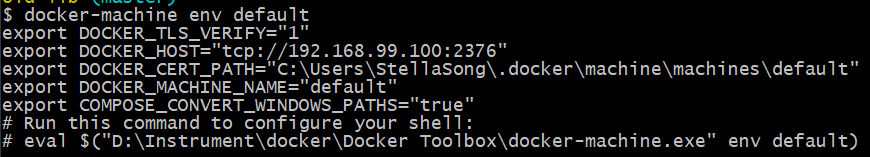
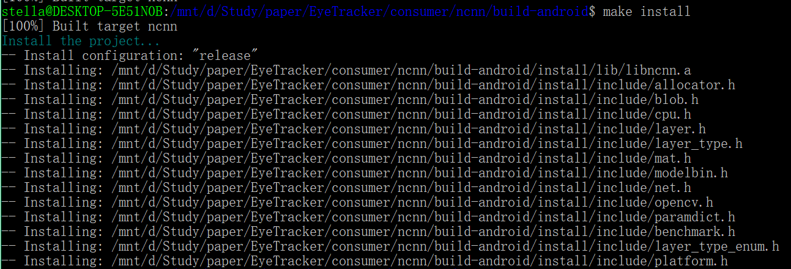
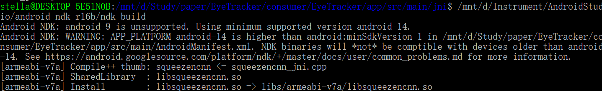

# EyeTracker

## 项目内容

### 功能描述

由安卓移动设备作为传感器，通过目视控制，使用者可以使用目视跟踪技术控制鼠标、使用屏幕键盘进行键入。

### 必要性

- 提供一种全新计算机交互方式，用眼球完整的进行系统层面交互。
- 为身体行动不便的群体提供帮助，为全世界许多ASL患者带来了在电脑上操作的可能。
- 采用手机作为传感器，方便快捷，减少设备购置成本。

### 特殊性

- [三星EyeCan](http://www.eyecanproject.org/p/english.html)：眼球鼠标，是一个安装在显示器下方的装置，可以让用户仅用眼球转动就可操控电脑。与之相比，这个项目采用手机作为外设，方便快捷，减少设备购置成本。
- [Windows 10 目视控制入门](https://support.microsoft.com/zh-cn/help/4043921/windows-10-get-started-eye-control)：采用Tobii外设，由屏幕上的启动板选择模式，控制执行相应鼠标操作或打字。与之相比，这个项目的目视检测模块运行在手机中，减少计算机的资源开销。

### 关键技术

- 实现安卓客户端，使用[caffe-android-lib](https://github.com/sh1r0/caffe-android-lib)将现有的眼动识别[caffe模型](https://github.com/CSAILVision/GazeCapture)移植到安卓客户端，实现校准、控制鼠标移动和点击、控制滚动的基础功能。
- 实现服务端，利用socket实现windows系统pc与android设备连接通信，涉及网络编程。
- 根据模型识别眼动精度调整具体交互方式。

### 参考文献

- [《Eye Tracking for Everyone》](https://people.csail.mit.edu/khosla/papers/cvpr2016_Khosla.pdf)Krafka K, Khosla A, Kellnhofer P, et al. Eye tracking for everyone[C]//Proceedings of the IEEE conference on computer vision and pattern recognition. 2016: 2176-2184.
- [andorid手机远程控制电脑](https://gitee.com/lujianing/android-remote-control-computer)

### 完成计划

- 阅读文件 11/2-11/15
- 编码 客户端：11/16-12/15 服务端：12/15-12/30
- 实验 1.1/1.16

## 第一次会议内容
*2018-10-26*

### 文献阅读

1. 《Battery-Free Eye Tracker on Glasses》

      *Li T, Zhou X. Battery-Free Eye Tracker on Glasses[C]//ACM Conference on Mobile Computing and Networking (MobiCom). 2018.*

      - 描述了一种基于瞳孔吸光特性的无电池可穿戴式眼动仪，可以同时跟踪瞳孔的二维位置和直径。
      - 通过在眼睛周围设置近红外(NIR)光和光电二极管，发射近红外光从各个方向依次照亮眼睛，由光电二极管感知反射光的空间模式，通过轻量级推理算法来推断瞳孔的位置和直径。
      - 该系统利用不同眼动阶段的特点，相应地调整其传感和计算，以进一步节省能源。
      - 原型机由现成的硬件组件组成，并集成到普通眼镜中。

2. 《Eye Tracking for Everyone》

      *Krafka K, Khosla A, Kellnhofer P, et al. Eye tracking for everyone[C]//Proceedings of the IEEE conference on computer vision and pattern recognition. 2016: 2176-2184.*
      - 利用手机或平板电脑摄像头直接实现人眼追踪。
      - 包含一个卷积神经网络iTracker，采用来自1450人的近250万帧图像进行训练，在ios系统的现代移动设备上实时运行(10-15fps)。
      - 与已有的方法相比，它的误差大大降低。

### 毕业项目构思

- 用眼球移动控制计算机的app；
- 利用上面提到第二篇文章中基于caffe实现并完成训练的模型，实现利用移动设备摄像头跟踪人眼运动.

### 导师反馈
同意构思，要求设计人眼运动与计算机的交互。

## 第二次会议内容
*2018-10-30*

### 毕业项目构思
模仿[Windows 10 目视控制](https://support.microsoft.com/zh-cn/help/4043921/windows-10-get-started-eye-control)的交互方式，实现人眼注视的校准、控制鼠标移动和点击、控制滚动的基础功能。

### 导师反馈
同意构思

## 11/15工作总结

### 阅读文件

- 阅读[我的第一个caffe Android程序](https://blog.csdn.net/mogoweb/article/details/79796713)，了解完成客户端人眼识别的主要工作有
      
      1. 使用docker编译caffe-android-lib
      2. 使用java代码编译并运行步骤1中编译好的头文件和库文件

- 阅读[andorid手机远程控制电脑](https://gitee.com/lujianing/android-remote-control-computer)，了解完成客户端（手机）与服务端（电脑）控制的主要工作有

      1. socket编程，手机和电脑在同一网段，电脑开启监听某个端口，手机向电脑端口发送消息
      2. 服务端调用鼠标移动或键盘相应api
      3. 客户端监听相应相应发送到服务端

### 配置客户端开发工作环境

- 开发环境：Windows 10家庭版 #1803

- 安装docker
      选择安装Docker Toolbox[Install Docker Toolbox on Windows](https://docs.docker.com/toolbox/toolbox_install_windows/)

  

- 使用docker编译[caffe-android-lib](https://github.com/sh1r0/caffe-android-lib)

    ```
      git clone --recursive https://github.com/sh1r0/caffe-android-lib.git
      cd caffe-android-lib
      # build image
      docker build -t caffe-android-lib .
      # run a container for building your own caffe-android-lib, e.g.,
      docker run --rm --name caffe-android-builder \
      -e ANDROID_ABI=x86_64 \
      -e N_JOBS=2 \
      -v $(pwd)/android_lib/x86_64:/caffe-android-lib/android_lib \
      caffe-android-lib ./build.sh
  ```

- 安装Android Studio

  ```
  Android Studio 3.1.2
  Build #AI-173.4720617, built on April 14, 2018
  JRE: 1.8.0_152-release-1024-b02 amd64
  JVM: OpenJDK 64-Bit Server VM by JetBrains s.r.o
  Windows 10 10.0
  ```


### 遇到问题

- 使用docker编译caffe-android-lib时，报错：

  > The command '/bin/sh -c curl -SL     http://dl.google.com/android/repository/android-ndk-r11c-linux-x86_64.zip     -o /tmp/android-ndk.zip     && unzip -q -d /opt /tmp/android-ndk.zip     && rm -f /tmp/android-ndk.zip' returned a non-zero code: 18

  查询得知，可能是docker hub修改源导致拉取资源失败，在DockerFile中把jdk和tomcat提高到当前版本下的最新更新解决。即增加内容

  ```
      # 设置环境变量
      ENV JAVA_HOME /home/jdk1.8.0_162
      ENV CATALINA_HOME /home/tomcat
      ENV PATH $PATH:$JAVA_HOME/bin:$CATALINA_HOME/bin
      ENV TZ Asia/Shanghai
  ```

## 11/30工作总结

### 前情回顾

- 经过努力，在windows上build[caffe-android-lib](https://github.com/sh1r0/caffe-android-lib)失败，具体参考[Caffe on windows???](https://github.com/sh1r0/caffe-android-lib/issues/91)，作者表明没有计划支持windows平台。
- 转而使用[ncnn](https://github.com/Tencent/ncnn/)，文档表明ncnn对各平台都有较好的支持，使用者较多，且维护人员较为活跃，经过评估开发友好。

### 编译ncnn

- 参考文档：[cmake 打包 android sdk](https://github.com/Tencent/ncnn/wiki/cmake-%E6%89%93%E5%8C%85-android-sdk)

- 编译环境：ubuntu on windows:

      No LSB modules are available.
      Distributor ID: Ubuntu
      Description:    Ubuntu 18.04.1 LTS
      Release:        18.04
      Codename:       bionic

- 编译工具：

      android-ndk-r16b：GNU Make 3.81
      cmake：version 3.10.2

- 编译过程

  1. 在ncnn文件夹根目录下执行：

  ```
      mkdir build-android
      cd build-android
      cmake -DCMAKE_TOOLCHAIN_FILE=$ANDROID_NDK/build/cmake/android.toolchain.cmake \
      -DANDROID_ABI="armeabi-v7a" -DANDROID_ARM_NEON=ON \
      -DANDROID_PLATFORM=android-14 ..
      make
      make install
  ```

      执行结果：
      
  
  
      在ncnn\build-android\install目录下得到include和lib文件。

  2. 在项目中添加demo中的cpp及mk文件，在jni文件夹执行：ndk-build

  
      
      在libs\armeabi-v7a目录下得到.so文件。
      
  3. 使用android studio编译，运行项目

- 模型转换

  由于ncnn加载模型为param和bin格式，需要对已有的caffe模型进行转换，具体参考[ncnn 组件使用指北 alexnet](https://github.com/Tencent/ncnn/wiki/ncnn-%E7%BB%84%E4%BB%B6%E4%BD%BF%E7%94%A8%E6%8C%87%E5%8C%97-alexnet)

  使用 caffe2ncnn 工具转换为 ncnn 的网络描述和模型

  > caffe2ncnn deploy.prototxt bvlc_alexnet.caffemodel alexnet.param alexnet.bin

- 编写java文件

  完成 EyeTrackerActivity.java 、 EyetrackerNcnn.java 及xml文件、mk文件的编写，eyetracker_jni.cpp待完成

### 遇到问题

- 执行ndk-build时报错：

  > /mnt/d/Study/paper/EyeTracker/consumer/EyeTracker/app/src/main/jni/squeezencnn_jni.cpp:81: error: undefined reference to 'ncnn::Net::load_param(unsigned char const*)'

  检查发现，Android.mk文件中install目录地址错误地指向了build文件夹而不是为android编译的build-android，修改后解决。

- 执行ndk-build时报错：
  > /mnt/d/Study/paper/EyeTracker/consumer/ncnn/src/mat.cpp:168: error: undefined reference to '__kmpc_fork_call'

  查询[issue#292](https://github.com/Tencent/ncnn/issues/292)得知，注释掉Application.mk文件中的 NDK_TOOLCHAIN_VERSION := 4.9 解决。

- 执行ndk-build时报错：
  >  error: arithmetic on a pointer to void
  
  >  const float* prob = out.data + out.cstep * j;

  查询[issue#256](https://github.com/Tencent/ncnn/issues/256)得知，修改squeezencnn_jni.cpp文件中194行为  const float* prob = out.channel(j); 解决。

## 12/15工作总结

完成服务端编程，实现手机通过socket连接电脑，可以完成移动鼠标、按下键盘的操作。

使用方法：\server 目录下执行 java -jar EyeTrackerServer.jar